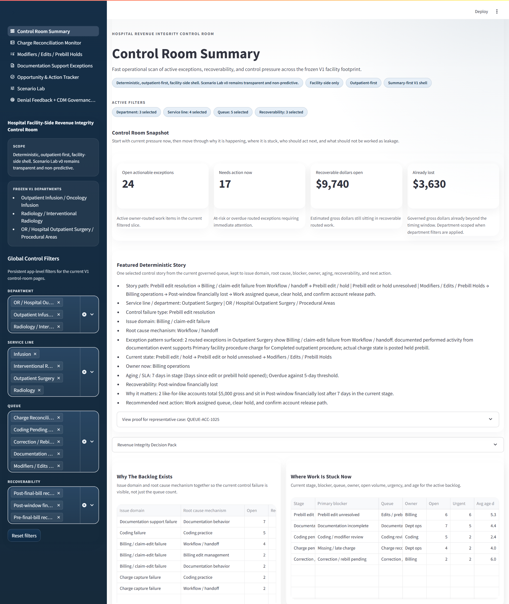
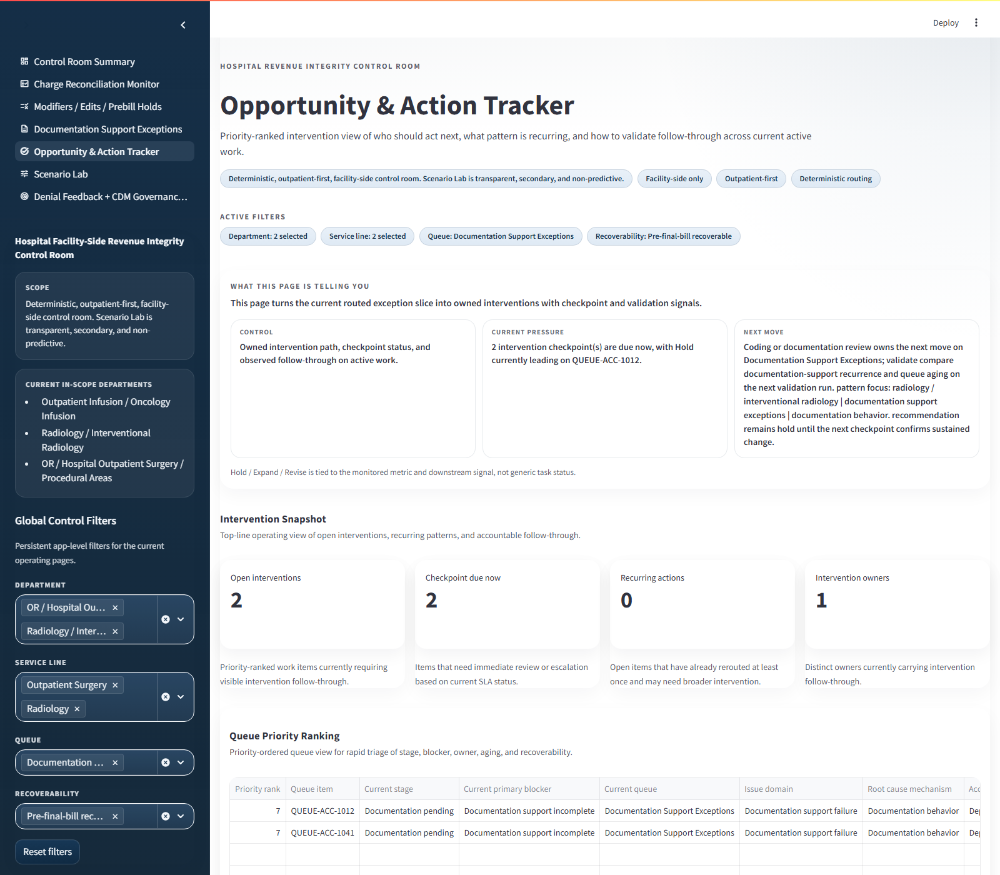
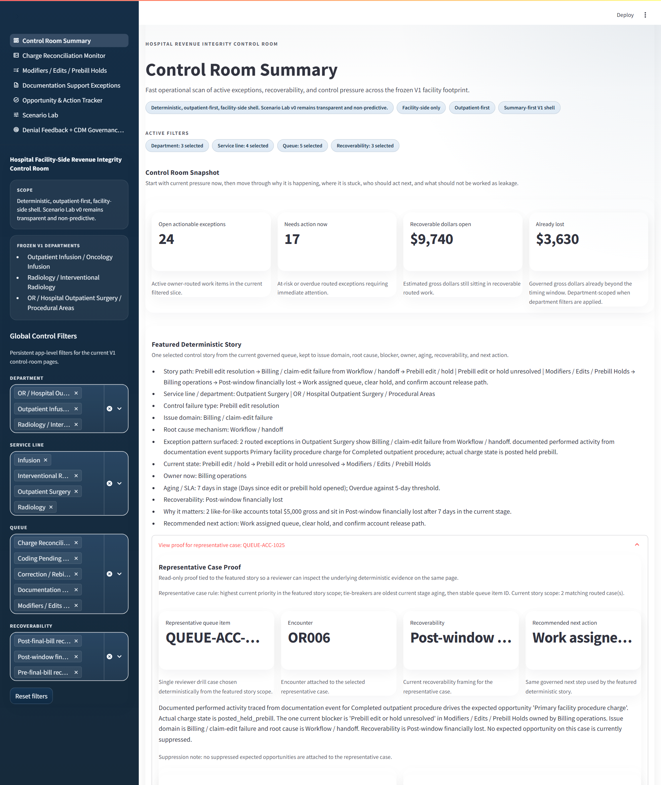

# Hospital Charge Capture Analytics

A deterministic, facility-side, outpatient-first revenue integrity control-room prototype that turns documented performed activity into owner-routed charge capture work using public-safe synthetic data.

In plain English: this app shows where completed outpatient hospital work likely should have produced a facility charge, why that charge is stuck or missing, who owns the next move, and what exposure is still recoverable.

Credibility comes from deterministic traceability, reviewer walkthrough proof, browser-visible operating pages, and explicit realism / validation materials already in the repo.

## Start Here In 4 Clicks

If you open only four repo links, use this order:

1. [Reviewer walkthrough](./artifacts/reviewer_walkthrough_pack/or_prebill_hold_story_walkthrough.md)
2. [Decision Pack export](./artifacts/decision_pack/revenue_integrity_decision_pack.md)
3. [Current shipped realism state](./artifacts/realism/post_tuning_realism_report.md)
4. [Test-backed credibility cue](./tests/test_case_detail_payload.py)

Use the [before/after realism diff](./artifacts/realism/realism_before_after_diff.md) only if you want the remediation bridge. The historical baseline is archived comparison context, not the first realism read.

## What This Is

- A Streamlit flagship app centered on deterministic failed-control detection, not dashboard-only reporting.
- A facility-side outpatient revenue integrity control room with active queues for reconciliation, documentation, prebill edits, and intervention follow-through.
- A reviewer-ready portfolio project with browser-visible walkthroughs, bounded validation materials, and exported proof.
- A public-safe synthetic dataset and build pipeline that show hospital-informed control-room behavior without PHI or private hospital data.
- A focused control-room product boundary: action-ready, scope-disciplined, and explicit about what is thin versus core.

## What This Is Not

- Not a generic BI dashboard.
- Not a denials-management or appeals platform.
- Not a predictive-first product or ML triage demo.
- Not a pro-fee, inpatient-first, or enterprise-wide rev-cycle suite.
- Not a production-integrated hospital deployment.

## Screenshots

<p align="center">
  <a href="artifacts/reviewer_walkthrough_pack/summary_featured_story.png"></a>
  <a href="artifacts/page_storytelling_validation/action_tracker_after.png"></a>
  <a href="artifacts/reviewer_walkthrough_pack/summary_featured_story_proof_open.png"></a>
</p>

<p align="center"><em>Summary story, intervention follow-through, and representative proof opened on the live summary page.</em></p>

## Quick Start

Supported Python: `3.12`-`3.13`. Tested on `3.13.3`.

Install path intent:

- [`requirements.txt`](./requirements.txt) is the pinned, reproducible demo path used by [`scripts/run_demo.py`](./scripts/run_demo.py).
- [`pyproject.toml`](./pyproject.toml) carries the package dependency ranges used by the editable install and contributor workflow.
- Use `python scripts/run_demo.py` for the recruiter/demo path. Use `python -m ri_control_room ...` after `python -m pip install -e .` for contributor and operating commands.

Primary one-command path:

```bash
python scripts/run_demo.py
```

What that command does:

- creates or reuses a local `.venv-demo` virtual environment
- installs pinned runtime dependencies there
- reuses existing processed demo artifacts or rebuilds them if they are missing or unreadable
- launches the Streamlit app
- prints a short end-of-boot summary with the local URL, first pages to open, artifact state, validation status, and `Ctrl+C` stop instruction

Validation is not run as part of the demo boot path.

This keeps the primary recruiter path isolated from your global Python environment.

Expected local URL:

```text
http://127.0.0.1:8501
```

Backup manual path if you want to mirror the pinned demo install steps yourself:

Create the virtual environment:

```bash
python -m venv .venv
```

Windows PowerShell:

```powershell
.\.venv\Scripts\Activate.ps1
python -m pip install -r requirements.txt
python -m pip install -e .
python -m ri_control_room demo
```

Windows no-activation fallback:

```powershell
.\.venv\Scripts\python -m pip install -r requirements.txt
.\.venv\Scripts\python -m pip install -e .
.\.venv\Scripts\python -m ri_control_room demo
```

macOS / Linux:

```bash
source .venv/bin/activate
python -m pip install -r requirements.txt
python -m pip install -e .
python -m ri_control_room demo
```

`python -m pip install -e .` is sufficient for editable contributor use because it installs the runtime ranges declared in [`pyproject.toml`](./pyproject.toml). Add `python -m pip install -r requirements.txt` first when you want the same pinned demo environment used by `python scripts/run_demo.py`.

If port `8501` is already busy, use `python scripts/run_demo.py --port 8502` or `python -m ri_control_room demo --port 8502`.

Contributor / operating path if you want the steps separated inside that same virtual environment:

```bash
python -m pip install -r requirements.txt
python -m pip install -e .
python -m ri_control_room build
python -m ri_control_room app
```

After the editable install, the `ri-control-room` console script is also available. The docs use `python -m ri_control_room ...` as the canonical contributor / operating command family so the install story stays consistent across platforms.

## What To Click First

1. `Control Room Summary`
   Start here for the main deterministic story: current failed control, blocker, owner, aging, recoverability, and next action.
2. `Opportunity & Action Tracker`
   Open the selected case evidence trace and follow-through sections to see queue governance, current owner, checkpoint status, and hold / expand / revise framing.
3. `Charge Reconciliation Monitor`
   Check how backlog, overdue pressure, and service-line scoping behave on one of the core operating pages.
4. `Documentation Support Exceptions`
   Use this page to see unsupported-charge pressure, documentation-gap patterns, and routing between documentation, coding, and operations.

## Repo Map

- [`scripts/run_demo.py`](./scripts/run_demo.py): recruiter-friendly demo bootstrap from a fresh-ish clone.
- [`app/streamlit_app.py`](./app/streamlit_app.py): Streamlit app entrypoint.
- [`app/pages/`](./app/pages): Summary plus the non-summary operating pages.
- [`src/ri_control_room/`](./src/ri_control_room): deterministic logic, synthetic generators, metrics, validation, UI helpers, and CLI.
- [`data/reference/`](./data/reference): governed public-safe reference tables that anchor the synthetic build.
- [`data/processed/`](./data/processed): generated synthetic artifacts used by the app.
- [`artifacts/`](./artifacts): walkthrough screenshots, proof packs, realism / validation materials, summary materials, and browser-visible evidence.
- [`docs/recruiter_quickstart.md`](./docs/recruiter_quickstart.md): 5-minute recruiter and hiring-manager guide.

## Proof And Validation Artifacts

If you do not run the app, start here:

- [Project summary and scope](./artifacts/project_summary_and_scope.md)
- [Proof index](./artifacts/proof_index.md)
- [Reviewer walkthrough pack](./artifacts/reviewer_walkthrough_pack/or_prebill_hold_story_walkthrough.md)

The [proof index](./artifacts/proof_index.md) links out to the realism materials, memo export, screenshots, and code-level tests if you want the deeper evidence map.

Strongest browser-visible screenshots:

- [Summary featured deterministic story](./artifacts/reviewer_walkthrough_pack/summary_featured_story.png)
- [Action Tracker work view](./artifacts/page_storytelling_validation/action_tracker_after.png)
- [Documentation support view](./artifacts/page_storytelling_validation/documentation_after.png)

## Public-Safe Note

- This repo uses synthetic, public-safe data only.
- No PHI, no private credentials, and no external hospital data are required in the default demo path.
- No `.env` file or secret configuration is needed to run the app locally.

## Known Scope Boundaries

- Facility-side only.
- Outpatient-first only.
- Deterministic-first product center; predictive logic is intentionally out of scope.
- Scenario Lab, denial feedback, and Decision Pack are thin supporting layers, not the main credibility claim.
- The repo proves deterministic control-room logic, traceability, and reviewer-ready packaging, not full payable-state modeling, production deployment maturity, or enterprise-natural source realism.
