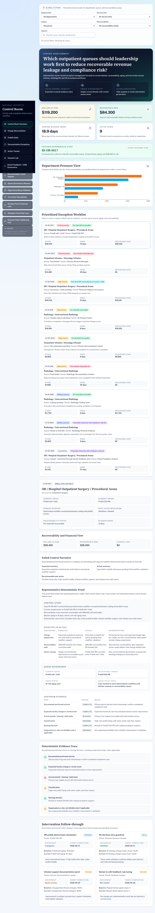
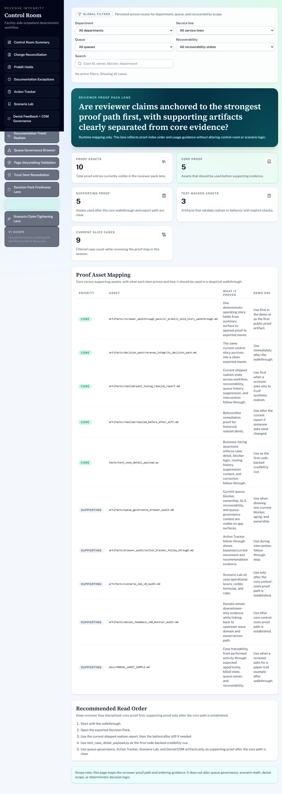
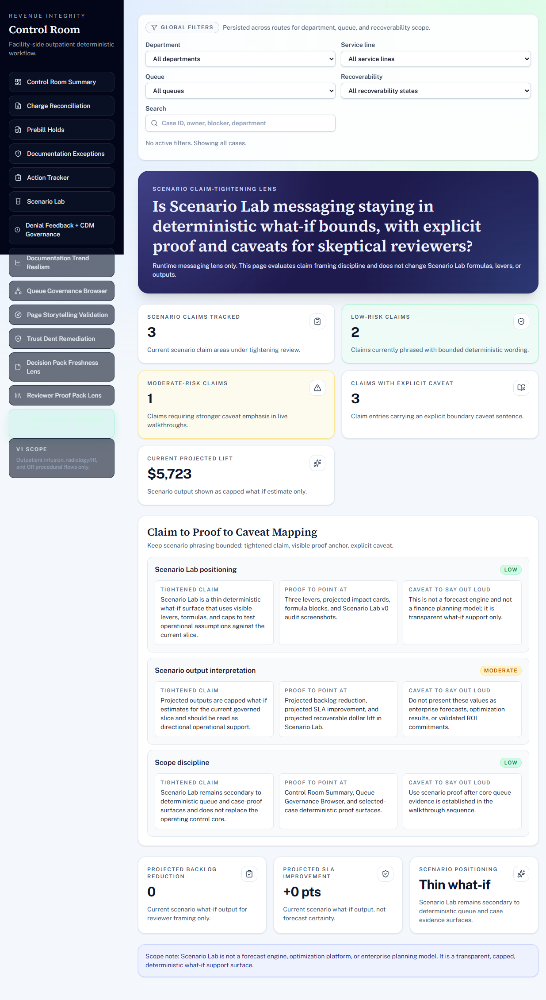
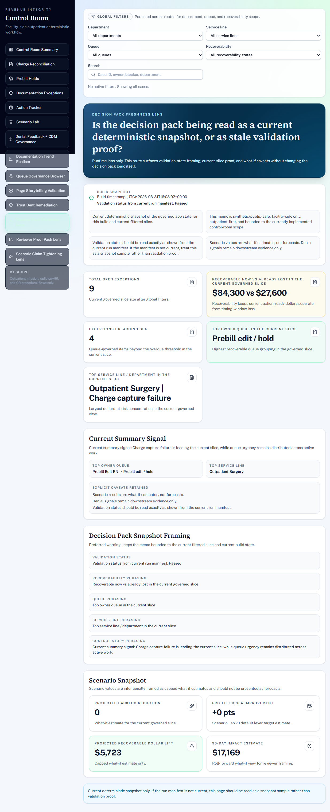
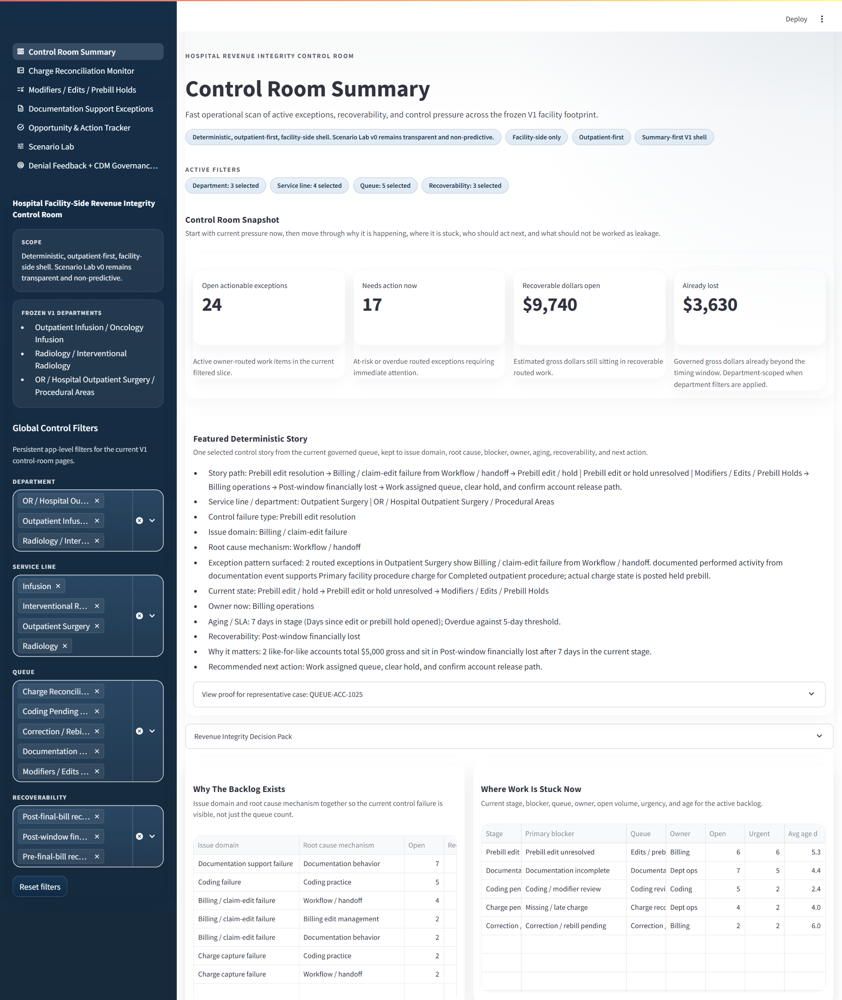
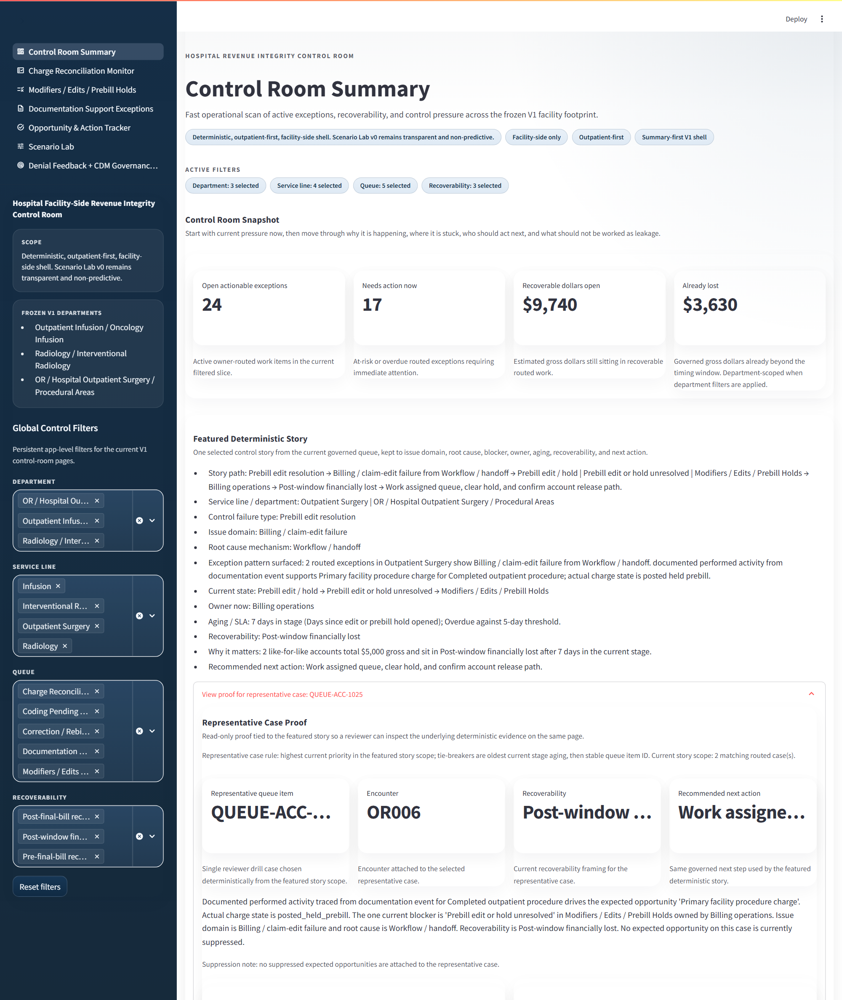
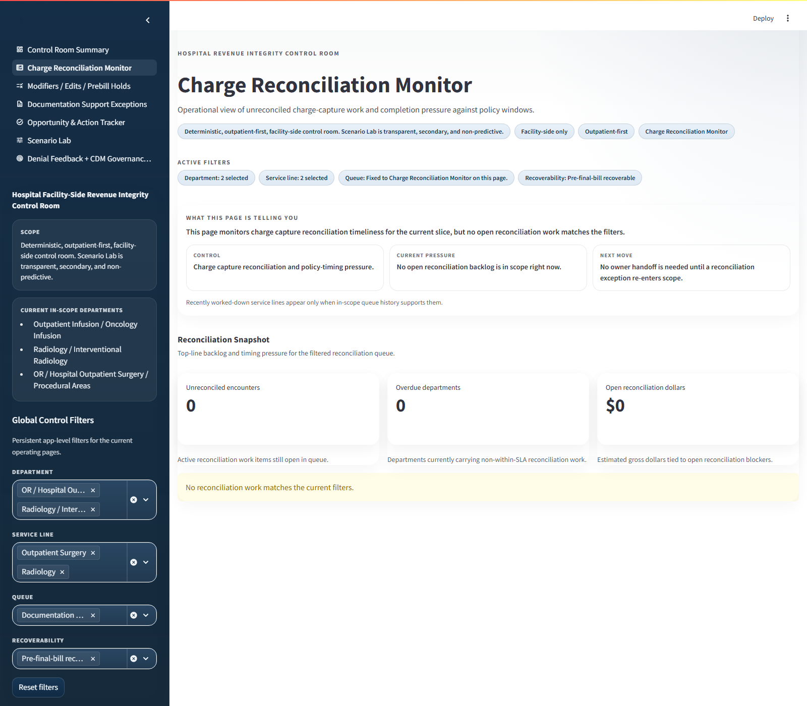
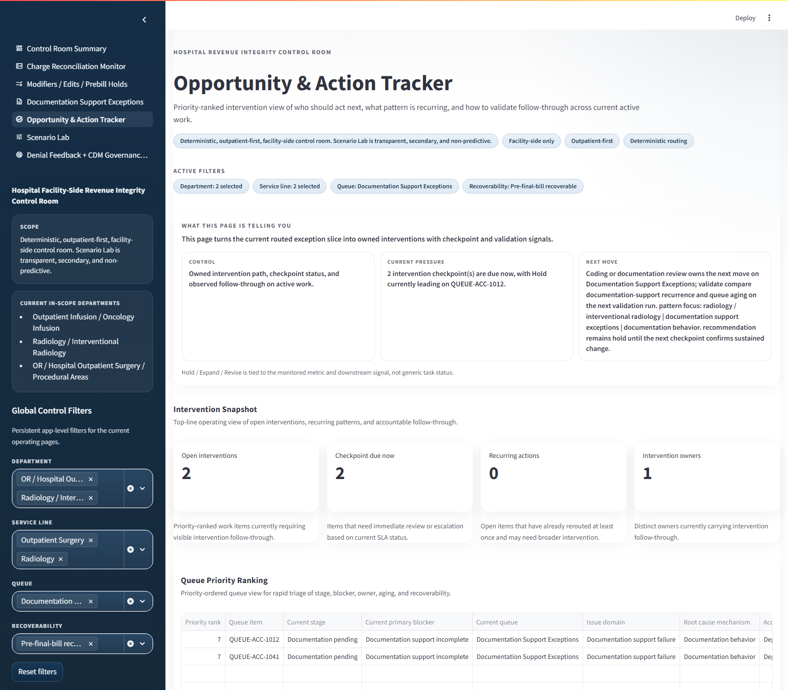
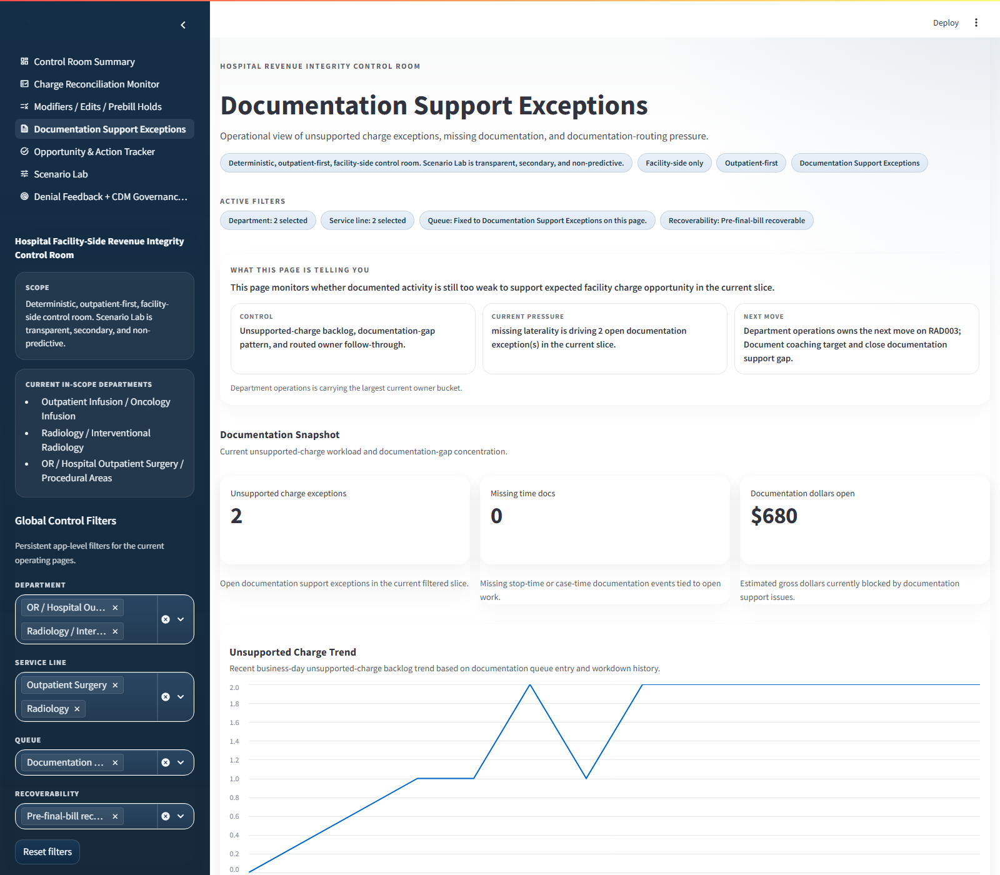

# Hospital Charge Capture Analytics

Hospital revenue integrity teams do not just need another dashboard. They need a clear view of when documented outpatient work should have become a facility charge, where the process broke, who owns the next step, and whether recovery is still possible.

This repo presents that problem as a deterministic control-room product with a React-first user experience on public-safe synthetic data. It traces documented performed activity to expected facility charge opportunity, surfaces the failed control, routes work to the accountable owner, and keeps blocker, aging, recoverability, and proof visible.

The app is fully interactive: selecting filters, queues, and cases updates panel state in place so detail views, metrics, and supporting context reflect the current selection.

Credibility comes from deterministic traceability, browser-visible operating pages, validation artifacts, and a clear scope boundary.

It is intentionally positioned as both analytics and product engineering: the React surface demonstrates typed domain modeling, deterministic computation, route-level interaction design, and reviewer-ready communication.

## Project Contributions

- Designed and implemented the deterministic exception logic and decision framework.
- Built the React-first product surface for queues, blockers, ownership, recoverability, and proof context.
- Defined KPI framing for backlog pressure, SLA risk, recoverability, and queue prioritization.
- Produced proof artifacts, validation notes, and decision-pack packaging to keep claims auditable.
- Set scope guardrails so scenario, denial, and memo layers remain secondary to the deterministic core.

## At a Glance

- Primary surface: React control-room app
- Core value: deterministic failed-control detection and owner-routed actionability
- Data posture: synthetic and public-safe
- Scope: facility-side, outpatient-first, deterministic-first
- Supporting proof: validation artifacts, browser audits, and decision-pack exports

## Business Impact Snapshot

- Current governed open exceptions: `24`, with `17` breaching SLA.
- Recoverability separation surfaced in one operating view: `$9,740` still recoverable vs `$3,630` already lost after timing window.
- Scenario-informed intervention upside (what-if, not forecast): backlog `-4`, SLA `+16.6` points, recoverable lift `+$2,464` (`$7,392` 90-day estimate).

For the narrative-first walkthrough, start with [case_study.md](./case_study.md).

## 60-Second Review Path

If you open only four repo links, use this order:

1. [Case study](./case_study.md)
2. [Reviewer walkthrough](./artifacts/reviewer_walkthrough_pack/or_prebill_hold_story_walkthrough.md)
3. [Decision Pack export](./artifacts/decision_pack/revenue_integrity_decision_pack.md)
4. [Current shipped realism state](./artifacts/realism/post_tuning_realism_report.md)

Use [tests/test_case_detail_payload.py](./tests/test_case_detail_payload.py) as a compact code-level credibility cue. Use [artifacts/realism/realism_before_after_diff.md](./artifacts/realism/realism_before_after_diff.md) only as remediation context after the shipped realism state.

## What This Is

- A React-first product for deterministic failed-control detection, not dashboard-only reporting.
- A facility-side outpatient control room with active queues for reconciliation, documentation, prebill edits, and intervention follow-through.
- A reviewer-ready project with browser-visible walkthroughs, validation materials, and exported proof.
- A Streamlit companion surface for supporting artifacts and comparison views.
- A public-safe synthetic dataset and build flow with explicit scope discipline.

## What This Is Not

- Not a generic BI dashboard.
- Not a denials-management or appeals platform.
- Not a predictive-first product or ML triage demo.
- Not a pro-fee, inpatient-first, or enterprise-wide rev-cycle suite.
- Not a production-integrated hospital deployment.

## Product Features

- Deterministic control trace: links performed activity to expected charge opportunity and pinpoints workflow failure.
- Queue-first model: keeps blocker, owner, aging, and recoverability visible at decision time.
- Fully interactive stateful UI: user selections dynamically update detail panels, KPI context, and supporting views.
- Product-grade React surface: route-based architecture with persistent filters and consistent interactions.
- Proof-aware framing: combines operating views with explicit proof order, caveats, and freshness language.
- Governance-ready prioritization: distinguishes work to do now, recoverable exposure, and financially closed but compliance-relevant states.
- Extensible typed design: domain contracts and deterministic modules support safe feature growth.
- Public-safe delivery: synthetic data and explicit boundaries support straightforward review and sharing.

### Feature Highlights

- Explainability by design: each surfaced exception is traceable from performed activity to expected charge opportunity to current blocker and owner decision.
- Stateful decision interface: filter and case selections dynamically recompose KPI context, queue ranking, and detail-panel evidence.
- Accountability-native workflow: each queue item keeps owner, aging, SLA posture, and next-step framing visible in one operating view.
- Recoverability intelligence: recoverable exposure is separated from already-lost timing-window exposure to support financially meaningful triage.
- Deterministic trust model: core prioritization is explicit and auditable without black-box scoring.
- Evidence-packaged storytelling: UI behavior, proof artifacts, and decision-pack language stay aligned for reviewer-safe communication.
- Scope-disciplined architecture: deterministic core remains primary while scenario, denial, and memo layers stay intentionally secondary.
- Public-safe reproducibility: synthetic data preserves confidentiality while still showing realistic queue transitions and intervention follow-through.

## Tech Stack and Methods

- Languages and framework: TypeScript, React, Streamlit (supporting companion)
- Product/UI delivery: route-based React app shell with persistent filter state and deterministic view logic
- Analytics method: deterministic rule-driven exception detection and queue-state governance
- Data posture: synthetic/public-safe dataset with explicit scope boundaries
- Validation approach: realism checks, browser-visible proof artifacts, and targeted test coverage

## Data Analysis Skills Demonstrated

- KPI design and metric governance for backlog pressure, aging, ownership, and recoverability.
- Root-cause analysis using issue-domain versus mechanism separation.
- Workflow and queue analytics using blocker-state and transition logic.
- Validation-first communication with tests, realism checks, and proof artifacts.
- Decision-oriented storytelling that turns analysis into actionable operating guidance.

## Resume-Ready Outcomes

- Converted a domain-heavy analytics problem into a decision-ready product surface with traceability from activity to action.
- Built an operating model that separates recoverable from already-lost exposure and makes owner accountability explicit.
- Delivered a proof chain that aligns UI behavior, exported memo language, and validation artifacts.
- Balanced product polish with scope discipline by keeping deterministic control logic as the credibility center.

## Screenshots

Use [case_study.md](./case_study.md) for the full narrative. The screenshots below are the compact visual preview.

### React App (Primary Product Surface)

<p align="center">
  <a href="artifacts/browser_audit/react_control_room_summary_2026-05-25.png"></a>
  <a href="artifacts/browser_audit/react_reviewer_proof_pack_lens_2026-05-25.png"></a>
</p>

<p align="center">
  <a href="artifacts/browser_audit/react_scenario_claim_tightening_lens_2026-05-25.png"></a>
  <a href="artifacts/browser_audit/react_decision_pack_freshness_lens_2026-05-25.png"></a>
  <a href="artifacts/browser_audit/react_surface_lens_screens_2026-05-25.md"></a>
</p>

<p align="center"><em>Primary product screenshots: React control-room shell, reviewer-proof ordering, scenario claim tightening, and decision-pack freshness framing.</em></p>

React screenshot captions:

- Control Room Summary: app-shell quality, persistent global filters, and deterministic queue framing.
- Reviewer Proof Pack Lens: core-proof-first ordering and explicit supporting evidence tiers.
- Scenario Claim-Tightening Lens: bounded claim wording tied to proof anchors and caveats.
- Decision Pack Freshness Lens: explicit snapshot-date framing and caveat-safe packaging language.

### Streamlit Dashboard Surfaces (Supporting Proof)

<p align="center">
  <a href="artifacts/reviewer_walkthrough_pack/summary_featured_story.png"></a>
  <a href="artifacts/reviewer_walkthrough_pack/summary_featured_story_proof_open.png"></a>
</p>

<p align="center"><em>Start on Control Room Summary, then open the representative proof to see why the case surfaced and who owns the next move.</em></p>

<p align="center">
  <a href="artifacts/page_storytelling_validation/charge_reconciliation_after.png"></a>
  <a href="artifacts/page_storytelling_validation/action_tracker_after.png"></a>
  <a href="artifacts/page_storytelling_validation/documentation_after.png"></a>
</p>

<p align="center"><em>Then move into the operating views that show queue pressure, intervention governance, and documentation support exceptions.</em></p>

## Quick Start

### React App (Primary)

One-click on Windows:

1. Double-click [Launch React Surface Demo.cmd](./Launch%20React%20Surface%20Demo.cmd)
2. Wait for dependency install on first run
3. Browser opens to the React app automatically

From repo root:

```bash
cd react-surface
npm install
npm run dev
```

Then open the local URL shown in the terminal (default is usually `http://127.0.0.1:5173`).

### Streamlit Companion (Supporting)

For recruiters and hiring managers on Windows:

1. Double-click [`Launch Hospital Charge Capture Demo.cmd`](./Launch%20Hospital%20Charge%20Capture%20Demo.cmd)
2. Wait for the local setup to finish on first launch
3. Let the browser tab open automatically

If the machine does not have Python installed, build the portable Windows package:

```powershell
python scripts/build_windows_portable.py
```

Then share `dist/windows-portable/` or `dist/hospital-charge-capture-analytics-windows-portable.zip` and have them double-click `Launch Hospital Charge Capture Demo.cmd` inside the packaged folder.

Terminal fallback:

```bash
python scripts/run_demo.py
```

If port `8501` is busy, use `python scripts/run_demo.py --port 8502`.

If you are here to learn how the project is put together rather than just run it, start with [docs/OPERATING_RUNBOOK.md](./docs/OPERATING_RUNBOOK.md).

## What To Click First

1. `Control Room Summary` for the main deterministic story.
2. `Opportunity & Action Tracker` for case evidence and follow-through.
3. `Charge Reconciliation Monitor` for backlog pressure and service-line routing.
4. `Documentation Support Exceptions` for unsupported-charge pressure and accountability.

## Repo Map

- [`react-surface/`](./react-surface): primary React product surface.
- [`Launch React Surface Demo.cmd`](./Launch%20React%20Surface%20Demo.cmd): one-click React launcher for Windows.
- [`Launch Hospital Charge Capture Demo.cmd`](./Launch%20Hospital%20Charge%20Capture%20Demo.cmd): primary Windows double-click launcher for local review.
- [`scripts/build_windows_portable.py`](./scripts/build_windows_portable.py): builder for the no-Python-required Windows package under `dist/`.
- [`scripts/launch_demo_windows.ps1`](./scripts/launch_demo_windows.ps1): PowerShell bootstrap used by the local Windows launcher.
- [`scripts/launch_portable_windows.ps1`](./scripts/launch_portable_windows.ps1): PowerShell bootstrap used inside the packaged portable build.
- [`scripts/run_demo.py`](./scripts/run_demo.py): recruiter-friendly demo bootstrap from a fresh-ish clone.
- [`case_study.md`](./case_study.md): narrative-first case-study walkthrough for portfolio review.
- [`app/streamlit_app.py`](./app/streamlit_app.py): Streamlit companion app entrypoint.
- [`app/pages/`](./app/pages): Summary plus the non-summary operating pages.
- [`src/ri_control_room/`](./src/ri_control_room): deterministic logic, synthetic generators, metrics, validation, UI helpers, and CLI.
- [`data/reference/`](./data/reference): governed public-safe reference tables that anchor the synthetic build.
- [`data/processed/`](./data/processed): generated synthetic artifacts used by the app.
- [`artifacts/`](./artifacts): walkthrough screenshots, proof packs, realism / validation materials, summary materials, and browser-visible evidence.
- [`docs/recruiter_quickstart.md`](./docs/recruiter_quickstart.md): 5-minute recruiter and hiring-manager guide.

## Proof And Validation Artifacts

If you do not run the app, start here:

- [Project summary and scope](./artifacts/project_summary_and_scope.md)
- [Proof index](./artifacts/proof_index.md)
- [Reviewer walkthrough pack](./artifacts/reviewer_walkthrough_pack/or_prebill_hold_story_walkthrough.md)

The [proof index](./artifacts/proof_index.md) links out to the realism materials, memo export, screenshots, and code-level tests if you want the deeper evidence map.

Strongest browser-visible screenshots:

- [React control-room summary shell](./artifacts/browser_audit/react_control_room_summary_2026-05-25.png)
- [React Reviewer Proof Pack Lens](./artifacts/browser_audit/react_reviewer_proof_pack_lens_2026-05-25.png)
- [React Scenario Claim-Tightening Lens](./artifacts/browser_audit/react_scenario_claim_tightening_lens_2026-05-25.png)
- [React Decision Pack Freshness Lens](./artifacts/browser_audit/react_decision_pack_freshness_lens_2026-05-25.png)
- [React screenshot refresh note](./artifacts/browser_audit/react_surface_lens_screens_2026-05-25.md)
- [Summary featured deterministic story](./artifacts/reviewer_walkthrough_pack/summary_featured_story.png)
- [Action Tracker work view](./artifacts/page_storytelling_validation/action_tracker_after.png)
- [Documentation support view](./artifacts/page_storytelling_validation/documentation_after.png)

## Public-Safe Note

- This repo uses synthetic, public-safe data only.
- No PHI, no private credentials, and no external hospital data are required in the default demo path.
- No `.env` file or secret configuration is needed to run the app locally.

## Known Scope Boundaries

- Facility-side only.
- Outpatient-first only.
- Deterministic-first product center; predictive logic is intentionally out of scope.
- Scenario Lab, denial feedback, and Decision Pack are thin supporting layers, not the main credibility claim.
- The repo proves deterministic control-room logic, traceability, and reviewer-ready packaging, not full payable-state modeling, production deployment maturity, or enterprise-natural source realism.

## Product Surface Note

- Main product surface: React app in [react-surface](./react-surface).
- Supporting analysis/proof surfaces: Streamlit app in [app/streamlit_app.py](./app/streamlit_app.py) and associated artifacts.

## Why React Matters Here

- Demonstrates production-style frontend development skills beyond analytics alone.
- Shows typed domain contracts and deterministic business logic mapped into reusable UI routes.
- Proves product communication quality through narrative-aware labels, proof packaging, and reviewer-oriented interaction flow.
