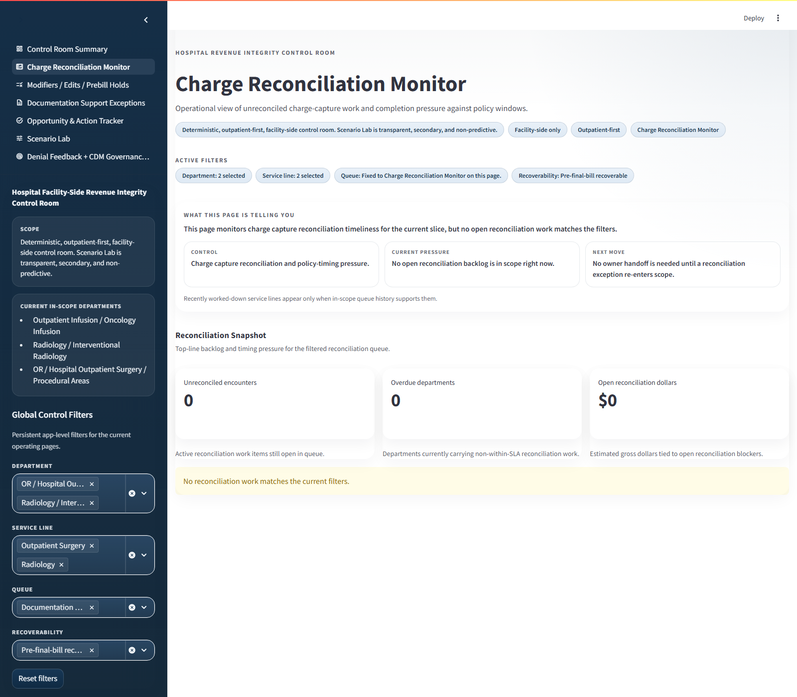
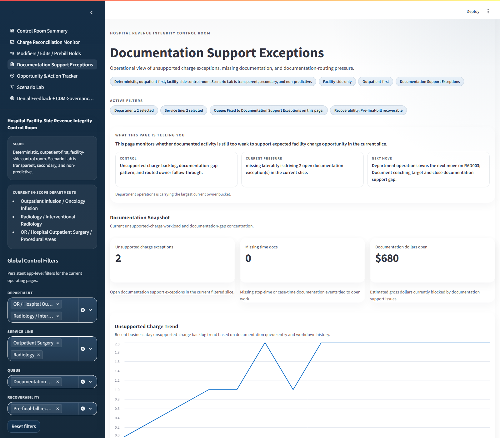

# Hospital Charge Capture Analytics Case Study

This repo is easiest to evaluate as a story, not as a feature list.

The core question is simple: when documented outpatient hospital work should have produced a facility charge but did not cleanly make it to billable state, can you tell what failed, who owns the next move, and whether the dollars are still recoverable?

This project answers that question with a deterministic, facility-side, outpatient-first revenue integrity control room built on public-safe synthetic data.

## The Business Problem

Hospital revenue leakage often appears first as ambiguity.

A procedure happened. Documentation exists. Something should likely have been charged. But the work can break across documentation, coding, CDM, billing edits, or operational handoffs. Generic dashboards can show lag, aging, and dollars. They usually do not tell a reviewer which control failed, why the case surfaced, who owns it now, or whether intervention still matters.

That is the gap this app is designed to close.

## The Story In One Case

The clearest reviewer-safe example in the repo is encounter `OR006`, surfaced as queue item `QUEUE-ACC-1025`.

An outpatient OR procedure is completed. Documented performed activity supports a primary facility procedure charge. But the account does not progress cleanly because it is stuck in `Modifiers / Edits / Prebill Holds`.

The app does not stop at "charge leakage detected." It narrows the story down deterministically:

- Failed control: `Prebill edit resolution`
- Issue domain: `Billing / claim-edit failure`
- Root cause: `Workflow / handoff`
- Current owner: `Billing operations`
- Aging: `7` days in stage, overdue against a `5`-day threshold
- Recoverability: `Post-window financially lost`
- Next move: clear the hold and confirm the account release path

That is the product claim: the repo makes the operating story legible, actionable, and provable.

## Visual Walkthrough

Start on the summary page, where one deterministic story is surfaced in plain language.

  
  

<em>The reviewer can see the surfaced case first, then open proof without leaving the narrative thread.</em>

Then move into the operating views that show how this is more than a single screenshot.

  
  
  

<em>Backlog pressure, intervention follow-through, and documentation support exceptions are visible as operating work, not just KPIs.</em>

## What The Reviewer Should Notice

1. The story begins with performed activity, not with a loose financial estimate.
2. The current failed control is explicit instead of buried in a generic exception bucket.
3. Ownership is visible at the case level.
4. Aging and recoverability make the work operational, not just descriptive.
5. The same story survives across summary, proof, and exported memo surfaces.

## Why This Matters

A believable analytics case study should show more than charts. It should show decision logic.

This repo demonstrates that a reviewer can move from surfaced issue, to case-level evidence, to routed intervention, to exported decision-pack language without the narrative changing. That is stronger than a dashboard that only says performance is off and leaves the reviewer guessing about cause and ownership.

## How To Review This Repo

After this page, use this order:

1. [Reviewer walkthrough](./artifacts/reviewer_walkthrough_pack/or_prebill_hold_story_walkthrough.md)
2. [Decision Pack export](./artifacts/decision_pack/revenue_integrity_decision_pack.md)
3. [Current shipped realism state](./artifacts/realism/post_tuning_realism_report.md)
4. [Project summary and scope](./artifacts/project_summary_and_scope.md)

If you want the boundary/spec path first instead, open [Project summary and scope](./artifacts/project_summary_and_scope.md).

## Scope Boundary

This case study is intentionally bounded.

- Facility-side only
- Outpatient-first only
- Deterministic-first
- Public-safe synthetic data only
- Not a denials platform
- Not a predictive triage demo
- Not a production-integrated hospital deployment

That boundary is part of the credibility. The repo is making a focused claim about deterministic control-room logic, traceability, and operating workflow clarity, not pretending to be a full enterprise rev-cycle platform.
